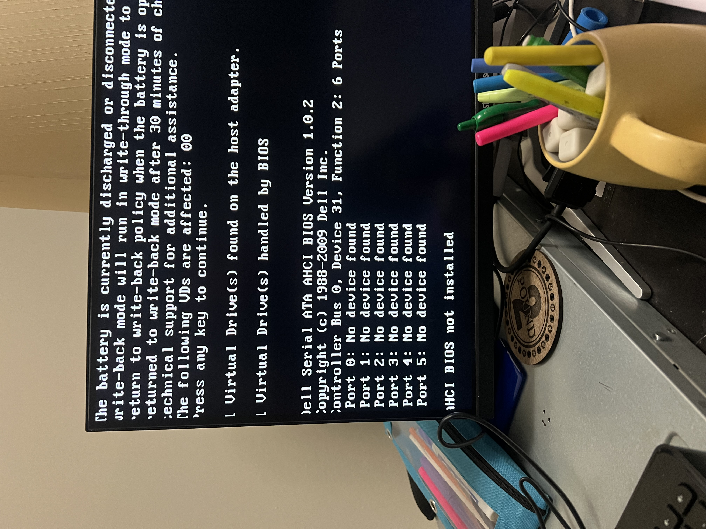
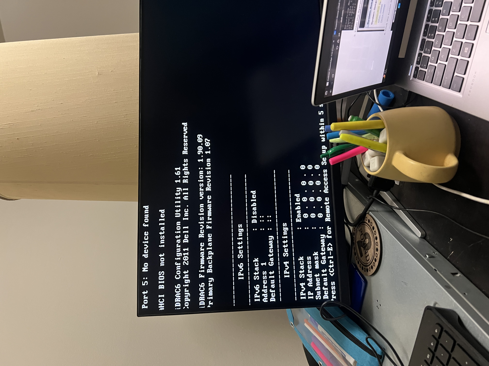

# Homelab Incident Log

This document tracks significant issues encountered in my homelab, including
system context, problems encountered, diagnosis, resolution, and lessons learned.

---
## Incident 001 – BIOS Boot Loop and SATA Mode Change (ATA → AHCI)
**Date:** 2026-02-21  
**System:** Dell PowerEdge R410  
**Status:** Open (Fix Planned)

### 1. System
Dell PowerEdge R410 enterprise server received secondhand.  
VGA used for local console access and iDRAC6 for out-of-band management.  
System intended for RAID configuration and homelab virtualization.

### 2. Problem
- On initial power-up, the system displayed a warning indicating a SATA controller mode change from ATA to AHCI.
- 
- 
- After confirming the warning, the system entered a repeated boot loop.
- BIOS access via F2 was not possible, preventing RAID configuration.

### 3. Diagnosis
- Existing data was intentionally discarded, so the SATA mode change itself was not a concern.
- iDRAC6 access remained functional, indicating partial system health.
- BIOS settings were not retained between reboots, and POST behavior repeated consistently.
- These symptoms are consistent with a failed CMOS battery, which can reset controller modes and prevent BIOS access.

### 4. Fix
Replace the CMOS battery, then:
- Re-enter BIOS
- Configure the SATA controller to RAID mode
- Verify settings persist across reboots

### 5. Lessons
- SATA mode change warnings can indicate BIOS configuration loss.
- Dead CMOS batteries can reset controller modes and block BIOS access.
- iDRAC availability does not imply BIOS or POST stability.
---
